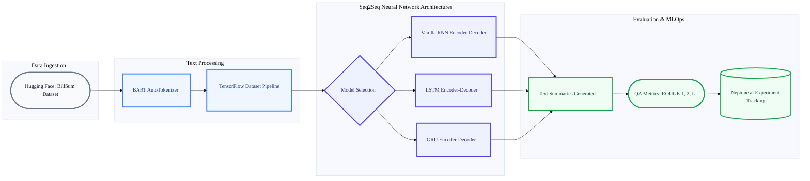

# 📝 GenAI Text Summarization: Sequence-to-Sequence NLP Pipeline


**GenAI Text Summarization** is a deep learning Natural Language Processing (NLP) pipeline designed to distill complex, high-volume text into concise, highly accurate summaries. Focusing on the **BillSum dataset** (US Congressional and California state bills), this project implements and evaluates three distinct Sequence-to-Sequence (Seq2Seq) neural network architectures to determine the optimal model for legal text summarization.

---

## 📑 Table of Contents
1. [Summary](#-summary)
2. [Why this Project?](#-why-this-project)
3. [Design Pattern & Pipeline](#-design-pattern--pipeline)
4. [System Architecture](#-system-architecture)
5. [Key Features](#-key-features)
6. [Tech Stack](#-tech-stack)
7. [Model Evaluation & Quality Assurance](#-model-evaluation--quality-assurance)
8. [Installation & Setup](#-installation--setup)

---

## 🎯 Summary
This project builds a comprehensive text processing and machine learning workflow. It utilizes Hugging Face's `BART-large-cnn` AutoTokenizer for robust text preprocessing, feeding the tokenized sequences into custom-built **RNN, LSTM, and GRU** models via TensorFlow/Keras. The entire training and evaluation lifecycle is meticulously tracked using **Neptune.ai** for MLOps monitoring. 

## 💡 Why this Project?
Legal documents and legislative bills are notoriously dense and lengthy, creating a significant barrier to information accessibility. This project automates the summarization of these documents, providing a scalable solution for legal professionals, researchers, and the public. Furthermore, by benchmarking three different RNN-based architectures, this project serves as a rigorous comparative study in deep learning performance and accuracy optimization.

## ⚙️ Design Pattern & Pipeline
The project utilizes an **Encoder-Decoder (Seq2Seq) Architecture Pattern**, which is highly effective for variable-length input-to-output translation tasks like summarization.
* **Text Preprocessing:** Leverages pre-trained Hugging Face tokenizers to truncate, pad, and convert raw text into uniform numerical matrices.
* **TensorFlow Data Pipelines:** Implements `tf.data.Dataset` for highly optimized, batched, and shuffled data feeding during training.
* **Experiment Tracking (MLOps):** Integrates Neptune.ai to log hyperparameters (vocab size, embedding dimensions, dropout), training loss, and ROUGE evaluation metrics in real-time.

## 🏗️ System Architecture


## ✨ Key Features
* **Comparative Deep Learning:** Custom implementation of SimpleRNN, LSTM, and GRU layers from scratch using Keras Subclassing (tf.keras.Model).
* **Comprehensive Data Handling:** Custom data collection logic supporting over 30,000 `.npy` files.
* **Static Translation:** Accurately classifies isolated manual alphabet characters.
* **Dynamic Translation:** Tracks temporal motion sequences to translate up to 10 distinct, continuous words.
* **System Profiling:** Real-time feedback on model performance, including average confidence percentages and inference speeds.

## 🛠️ Tech Stack
* **Programming Language:** Python 3.10
* **Deep Learning Framework:** TensorFlow 2.15.0, Keras
* **NLP & Data:** Hugging Face transformers & datasets, NLTK, rouge-score
* **MLOps / Tracking:** Neptune.ai
* **Data Processing:** NumPy, Pandas

## 🚀 Installation & Setup

### Prerequisites
Ensure you have Python 3.10+ installed. It is highly recommended to run this project in a Google Colab environment with GPU acceleration enabled.

### Step-by-Step Guide
1. **Clone the Repository:**
   ```bash
   git clone [https://github.com/dR-ViBE/GenAI_Text_Summarization.git](https://github.com/dR-ViBE/GenAI_Text_Summarization.git)
   cd GenAI_Text_Summarization
2. **Create a Virtual Environment (Recommended):**
   ```bash
   python -m venv mp_env
   source mp_env/bin/activate  # On Windows use: mp_env\Scripts\activate
   
3. **Install Dependencies:**
   ```bash
   pip install -r requirements.txt
4. **Launch the Pipeline:**
   ```bash
   jupyter notebook Text_Summarisation.ipynb

5. **Neptune.ai configuration:**
   Ensure you have a Neptune API token. You will need to replace the api_token and project string in the notebook with your personal Neptune credentials to log your own runs.

## 📊 Model Evaluation & Quality Assurance

The models were evaluated using the ROUGE (Recall-Oriented Understudy for Gisting Evaluation) metric to determine textual overlap and summary fidelity.

<table>
  <thead>
    <tr>
      <th>Model Architecture</th>
      <th>ROUGE-1 (Unigrams)</th>
      <th>ROUGE-2 (Bigrams)</th>
      <th>ROUGE-L (LCS)</th>
    </tr>
  </thead>
  <tbody>
    <tr>
      <td><b>Vanilla RNN</b></td>
      <td>0.764</td>
      <td>0.607</td>
      <td>0.764</td>
    </tr>
    <tr>
      <td><b>LSTM Seq2Seq</b></td>
      <td>0.902</td>
      <td>0.830</td>
      <td>0.901</td>
    </tr>
    <tr>
      <td><b>GRU Seq2Seq (Best)</b></td>
      <td><b>0.970</b></td>
      <td><b>0.948</b></td>
      <td><b>0.971</b></td>
    </tr>
  </tbody>
</table>
